# defect-detection
# Final Report: Vibration Data-Driven Detection of 3D Printing Defects

Video: https://youtu.be/OE90lJfHbwc

## Building the Code
- The makefile installs dependencies / sets up environment (**make install**) and runs the main model training/testing file, model.ipynb (**make run**)
  - Note that due an issue with running jupyter notebooks via make, the makefile has to convert model.ipynb to a separate output file, executed_model.ipynb, which will have the all the outputs.
  - Otherwise, model.ipynb should run fine locally 
  - model.ipynb also contains feature visualizations
- For the intended goal of real-time 3D print monitoring, the features are computed live, while the 3D print is running, parallel to the real-time raw accelerometer data log. This is because calculating features offline for such dense raw data would be extremely time-consuming. The script used to log both the raw data and calculate the rolling features is adxl_raw_plus_features_edited.py.
  - However, to test out the feature calculation offline, you can run offline_feature_calc.py (this is included in the **test_feature_calc Github workflow**), which will calculate rolling features on a small sample of raw accelerometer (corresponding to a few seconds of a print) called leaf_raw_accel_sample.csv. 
- Because the features are rolling over a window with overlap, the feature rows for each individual print are not independent and therefore cannot be split across train/val/test. To avoid data leakage, one print must belong to one dataset. Therefore, the datasets are pre-split (rather than using train_test_split) and designed to distribute geometries and conditions. The files are included in this repo in /datasets.

## Background & Motivation Recap
- The process of 3D printing produces **distinct vibrational profiles** that are most prominent near the nozzle and on the print bed, and can be detected using an accelerometer
- These vibrational profiles can **change when defects or anomalies** occur 
- This project specifically aims to **collect and model accelerometer data** for detecting 3D prints with a **fully clogged nozzle** (where there is no extrusion at all) vs. **unclogged nozzle condition** (regular extrusion)
- This is based on existing research on 3D print monitoring from accelerometer data, including:
  - Li, Yongxiang, et al. "In-situ monitoring and diagnosing for fused filament fabrication process based on vibration sensors." Sensors 19.11 (2019): 2589. 
  - Isiani A, Weiss L, Bardaweel H, Nguyen H, Crittenden K. Fault Detection in 3D Printing: A Study on Sensor Positioning and Vibrational Patterns. Sensors (Basel). 2023 Aug 30;23(17):7524.
  
## Approach & Experimental Setup for Dataset Collection
- The first step was setting up the accelerometer data collection system, which was a fairly involved process with several hiccups (mostly firmware-related) but is now running smoothly!
- Hardware/firmware: 
  - Ender 5 Plus with Klipper/Moonraker firmware running on a Raspberry Pi 3B+
  - ADXL345 accelerometer
- Mounted accelerometer using [this 3D printed mount](https://www.printables.com/model/343758-adxl345-bltouchcrtouch-mount/comments) from Printables screwed to printer (insert photo)
- Wired accelerometer to Raspberry Pi & enabled SPI connection on Raspberry Pi (originally tried standard I2C connection but it had too low throughput for capturing high frequency vibrations; I could only get up to ~120 Hz whereas SPI goes up to 3200 Hz)
Updated printer.cfg file in Klipper firmware (via Fluidd interface) 
- Enabled API socket based on [instructions](https://www.klipper3d.org/API_Server.html)
- While basic info such as print status can be accessed with HTTP REST API, accessing more advanced Moonraker endpoints, especially for large streamed data including the adxl345/adxl345_dump endpoint, requires websocket client — used websocat client in terminal to sanity-check the adxl345_dump endpoint stream, and then websockets package in Python script to log and write the data to CSV file
  - % websocat ws://192.168.50.10:7125/klippysocket
  - Then enter {"id": 1, "method": "adxl345/dump_adxl345", "params": {"sensor": "adxl345"}}
- Obtained API authorization key prior to this 
- Wrote accelerometer data logging script in Python 
- **Dataset Design** — In my original proposal, I was focused on getting many iterations of prints for a few geometries. However, since reading literature in this area that uses a relatively small number of prints to train models, as well as setting up a sensor polling connection with a very high output data rate, I've decided to focus less on maximizing the number of iterations of a given print in the dataset and more on maximizing **variation in geometries** in the dataset
  
## Data Logging, Processing, and Cleaning
- The adxl345/adxl345_dump endpoint gives raw accelerometer readings
  - The format of each entry is time, x_acceleration, y_acceleration, z_acceleration (e.g., 61895.221076, 74.020594, 296.082377, -9652.803275)
- The sampling rate of the accelerometer data is 3200 Hz, which corresponds to an output rate of about 4 million raw data points per 25 minutes of printing.
- My data logging script **outputs three different files**:
  - **1. Raw accelerometer values** (at maximum output data rate; thousands of data points per second)
  - **2. Rolling statistical features** computed over windows of every 1000 data points (with a step size of 200 data points)
    - This includes, on each of the X, Y, and Z axes: root mean square (RMS), mean, standard deviation, crest factor, and kurtosis
  - **3. Print status information** from the API, including progress, current/target temperatures
    - The print status log begins first, and there’s a **shared flag mechanism** in the script that starts the accelerometer data log when the script detects that the actual printing has started (i.e. not just preparing), which happens when current temperatures == target temperatures. (Originally used a global variable for this but then switched to threading implementation)

## Preliminary Visualizations on Individual Prints
- The most straightforward way to visualize dense accelerometer data is with a **spectrogram**, computed using Short-Time Fourier Transform, which breaks down raw signals into a range of different frequencies and visualizes the strength of different frequency bands
- As we can see in **these example of spectrograms** of the **magnitude** (calculated w/ **Euclidean norm**) of the acceleration signals for a fully clogged (zero extrusion) snowflake vs partially clogged (weak extrusion) snowflake, there are some differences -- namely, a larger magnitude of signal activity at several frequency bands in the print with a partial clog vs a full clog -- but further modeling is needed to properly identify/interpret the differences
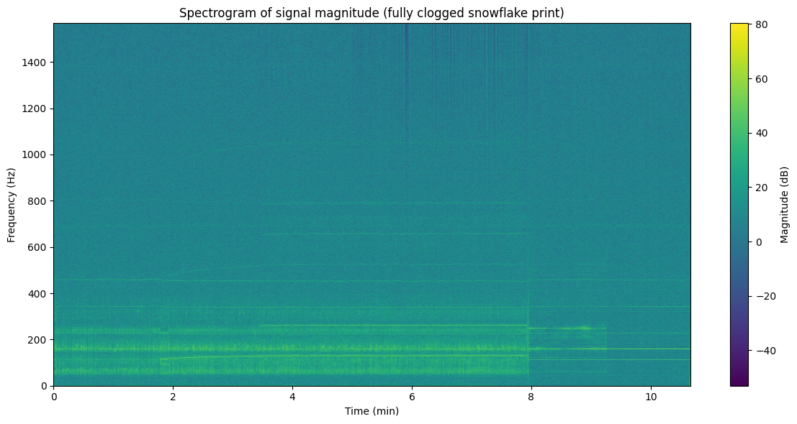 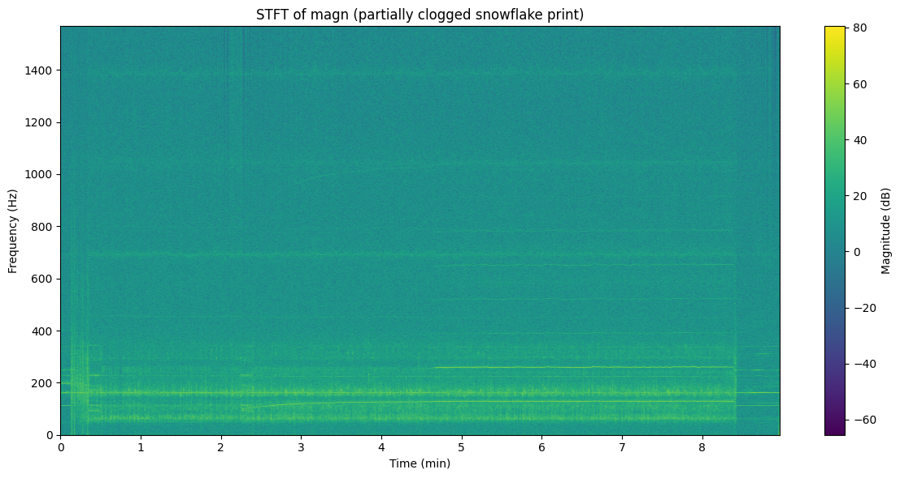

 **Principal Component Analysis** 

- Examples run on individual fully vs. partially clogged 3d prints:
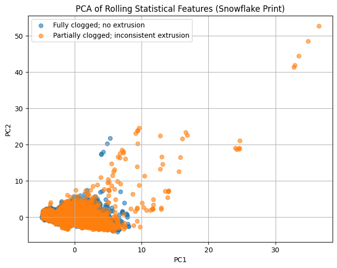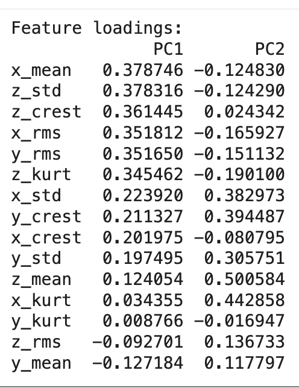
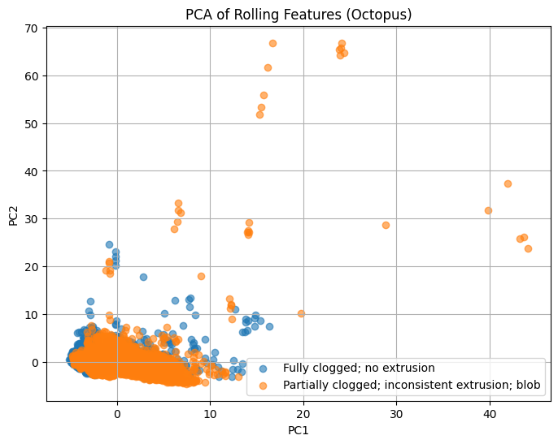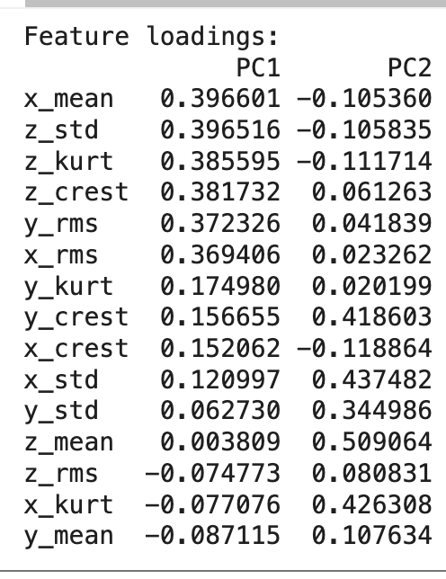
  - We can see in the examples that while the features tend to be similar in fully clogged vs partially clogged prints, there is some more variance along both PC1 and PC2 in a partially clogged print with extrusion.

## Dataset Feature Visualizations
After the full dataset was created, I used both histograms and kernel density estimates on log-scaled features to visualize some of the statistical features on the clogged versus unclogged print data. The following are some examples of features with visible differences across the clogged vs unclogged class.
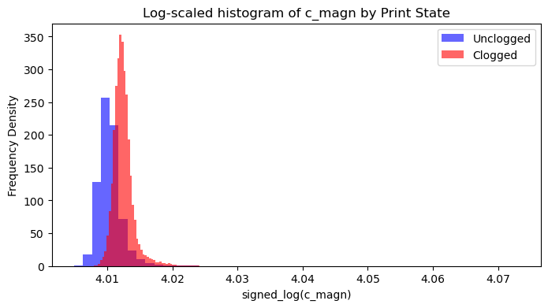 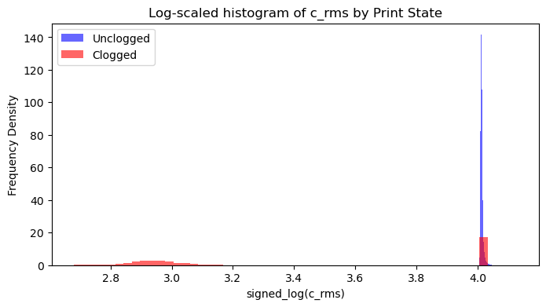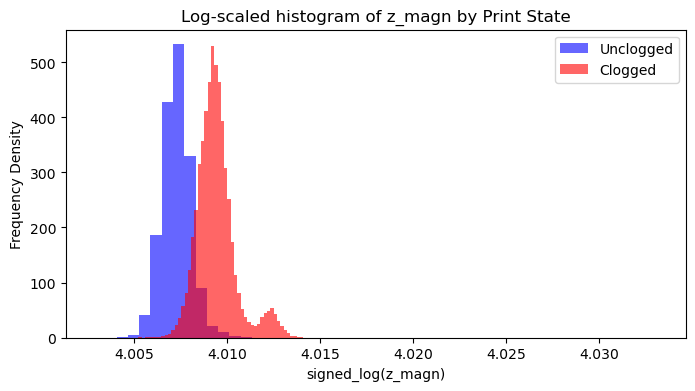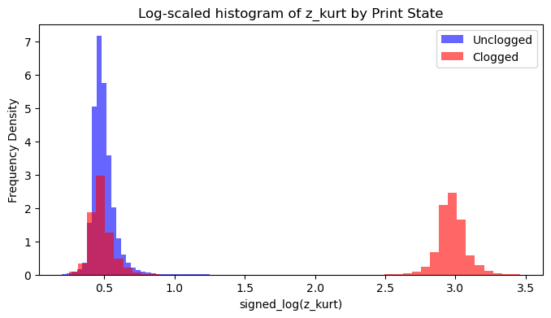

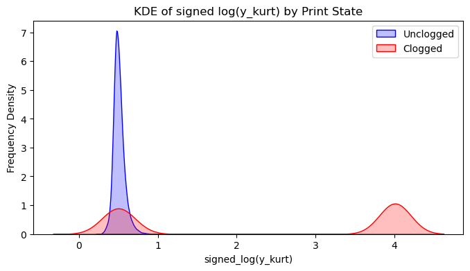 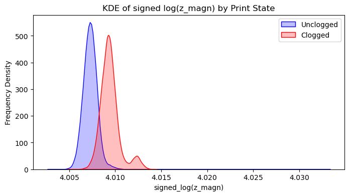

I also computed the correlations of features to print states (0 for clogged, 1 for unclogged), with promising results in both positive and negative correlation.
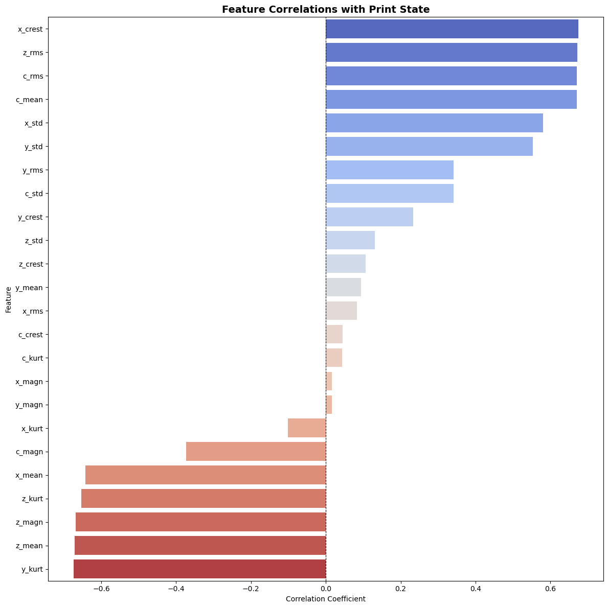

Finally, I visualized a heatmap to compare correlations among the features themselves -- mostly to check whether any of the combined-axis features had too strong correlation with individual-axis features. 
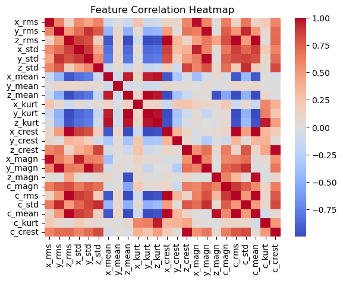

## Training the Model: Random Forest Classifier
- The dataset is likely full of non-linearly-separable relationships!
- Existing research has used support vector machines for similar types of data, but this data would likely need a kernel, which could be slow
- Instead used Random Forest classifier which is an ensemble method that is well equipped to handle non-linearities
- Note that because RF is a decision-tree based method, it's also not sensitive to scale!
- Used 200 decision trees, unlimited depth, and a random seed for reproducibility

## Results
For result metrics, I'm primarily interested in recall on the 0 (clogged) class!
For detecting errors such as clogs, we'd prefer having a few more false positives over potentially missing a clog that can ruin a print and cause a loss of print time and resources!

# Validation Set Metrics
**Classification Report:**
| Class            | Precision | Recall | F1-Score | Support |
| ---------------- | --------- | ------ | -------- | ------- |
| 0                | 1.00      | 0.81   | 0.89     | 22,768  |
| 1                | 0.74      | 0.99   | 0.84     | 11,973  |
| **Accuracy**     | -         | -      | 0.87     | 34,741  |
| **Macro Avg**    | 0.87      | 0.90   | 0.87     | 34,741  |
| **Weighted Avg** | 0.91      | 0.87   | 0.88     | 34,741  |

**Confusion Matrix:** (top row is true clogged, right column is 'predicted normal')

[[18484  4284]

 [   80 11893]]

# Test Set Metrics:
**Classification Report:**

| Class            | Precision | Recall | F1-Score | Support |
| ---------------- | --------- | ------ | -------- | ------- |
| 0                | 0.63      | 1.00   | 0.78     | 7,440   |
| 1                | 1.00      | 0.92   | 0.96     | 54,346  |
| **Accuracy**     | -         | -      | 0.93     | 61,786  |
| **Macro Avg**    | 0.82      | 0.96   | 0.87     | 61,786  |
| **Weighted Avg** | 0.96      | 0.93   | 0.94     | 61,786  |

**Confusion Matrix:** (top row is true clogged, right column is 'predicted normal')

[[ 7440     0]
 
 [ 4290 50056]]

# Testing on more unseen geometry
To push the model further, I reconfigured a different train/test dataset split so that we would test on more new geometries that are not in the training set and see how well the model can generalize to new geometries.
The clog recall is still fairly high! Accuracy and F1 scores are high as well, comparable to published results for similar projects. 

**Classification Report:**

| Class            | Precision | Recall | F1-Score | Support |
| ---------------- | --------- | ------ | -------- | ------- |
| 0                | 0.95      | 0.88   | 0.92     | 40,013  |
| 1                | 0.88      | 0.95   | 0.92     | 37,820  |
| **Accuracy**     | -         | -      | 0.92     | 77,833  |
| **Macro Avg**    | 0.92      | 0.92   | 0.92     | 77,833  |
| **Weighted Avg** | 0.92      | 0.92   | 0.92     | 77,833  |

**Confusion Matrix:** (top row is true clogged, right column is 'predicted normal')
[[35222  4791]

 [ 1730 36090]]

